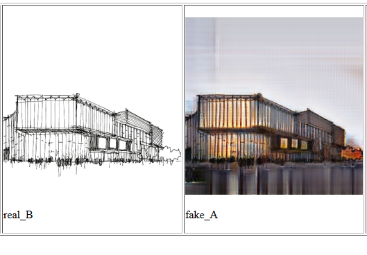

# sketchGAN
Using CycleGAN with building sketches + images



## Creating a dataset
To train a CycleGAN model, you need two sets of images representing the two archetypes you want to translate between (in our case, images of buildings and sketches of buildings). For convenience, you can place them in the datasets folder under `trainA` and `trainB`.

For best results, the images should be the same size (we used 512x512px). You can use [dataset-tools](https://github.com/dvschultz/dataset-tools) to quickly resize, crop, or stretch images to a common size and format.

## Training a model
Using a NVIDIA GPU with CUDA Deep Neual Network (cuDNN) installed (we used a machine from [Paperspace](https://paperspace.io)):

Clone the [pyTorch implementation of CycleGAN](https://github.com/junyanz/pytorch-CycleGAN-and-pix2pix):

```
git clone https://github.com/junyanz/pytorch-CycleGAN-and-pix2pix
cd pytorch-CycleGAN-and-pix2px
```

Install depedencies:
```
pip install -r requirements.txt
```

Train the model:
```
python train.py --dataroot /path/to/datasets --name sketch2building --model cycle_gan
```
**NOTE:** This process can takes 24-48 hours, depending on the specs of the machine + GPU you are using to train it.


## Using a model

TBD: Still figuring this one out 😅

Update: Used [Pix2PixHD](https://github.com/NVIDIA/pix2pixHD) model (a much more advanced CoGAN than Pix2Pix which uses semantic segmentation in the input labels to drastically improve the results). It was not possible to do the same for our custom dataset, but there were dramatic improvements by increasing the size of training dataset and restricting the images to mostly one or two type of objects.
Some of the test results: 


## Resources & Credits/Thanks

[OpenCV](https://opencv.org/) for dataset processing from images

[CycleGAN](https://github.com/junyanz/pytorch-CycleGAN-and-pix2pix) for training

[dataset-tools](https://github.com/dvschultz/dataset-tools) by dvschultz

Thanks to Derrick Schultz for sharing his lectures on the CycleGAN process. Check out his work [here](https://mkt.com/bustbright).
